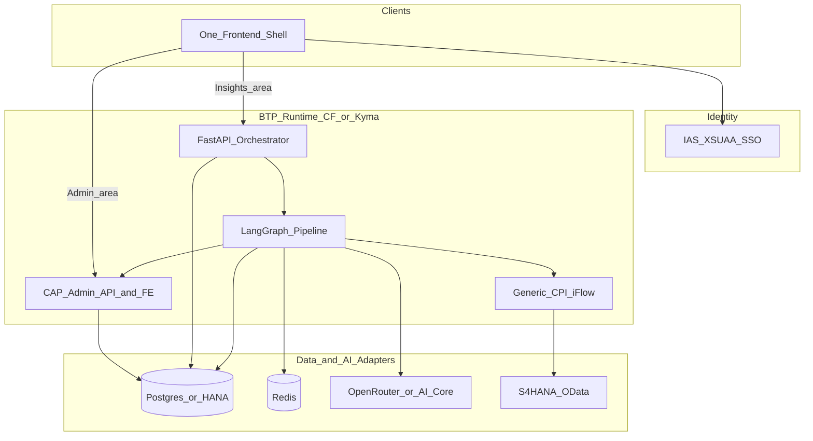
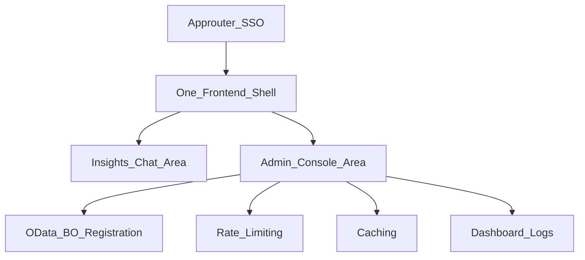
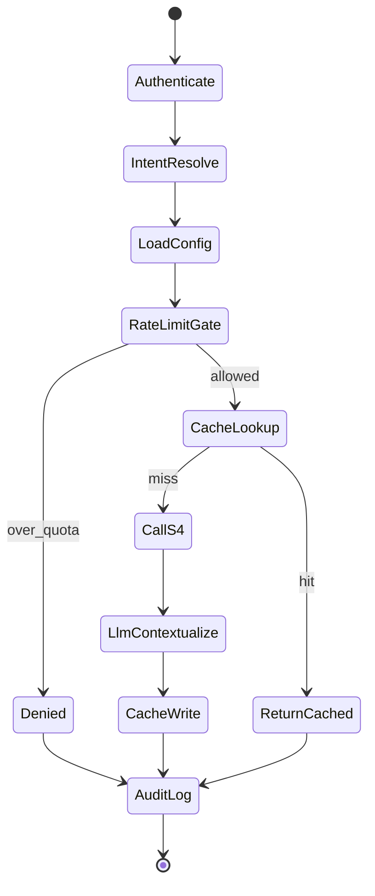

# Architecture Concept: AI-Assisted S/4HANA Business Insights

**Status:** Working draft (documentation phase — repo not initialized yet)  
**Audience:** SAP BTP + AI engineering  
**Version:** 0.6  
**Primary domain (MVP content):** Supply Chain Management (SCM) insights on S/4HANA  
**Quality bar:** Production-close — dual runtime (CF + Kyma) and dual LLM (OpenRouter + AI Core) are first-class  
**Reference landscape:** Single BTP trial for build/test; then Terraform onboard to client environments  
**Extensibility goal:** Same platform reusable for other S/4 modules/business areas by **registering OData services in CAP** — no new iFlow per object  
**Primary requirements:**

- [Documentation.docx.md](../requirements/Documentation.docx.md)
- [Technical_Design_Document.docx.md](../requirements/Technical_Design_Document.docx.md)

**Related planning docs:**

- [Decisions_Log.md](./Decisions_Log.md)
- [MVP_Roadmap.md](./MVP_Roadmap.md)
- [Component_Contracts.md](./Component_Contracts.md)
- [Client_Onboarding.md](./Client_Onboarding.md)
- [FAQ_and_Clarifications.md](./FAQ_and_Clarifications.md) — Q&A from planning discussions
- [Requirements_Aligned_Thick_CPI_Architecture.md](./Requirements_Aligned_Thick_CPI_Architecture.md) — requirements/TDD baseline (thick CPI)


---

## 1. Design thesis

Do **not** put agentic orchestration inside CAP alone. CAP is excellent for SAP-native admin UIs, CDS, XSUAA scopes, and Fiori Elements — weak as a CrewAI/LangGraph-style orchestration host.

**SCM-first, module-reusable:** The first packaged content targets supply-chain questions (Delivery, Shipping, Goods Movement, Purchasing, Sales logistics). The runtime is **not** hard-coded to SCM. Any future module (e.g. Finance, Plant Maintenance) is onboarded by registering another OData-backed business object in CAP — the generic CPI iFlow and LangGraph pipeline stay unchanged.

Use a **hybrid** architecture:

| Concern | Runtime | Why |
| --- | --- | --- |
| Admin config + dashboard UIs | CAP (Node.js) + Fiori Elements on **CF and Kyma** | SAP UX, roles, CDS, Fiori Elements productivity |
| AI query orchestration | **FastAPI** + **LangGraph** | Lightweight, first-class LLM/agent graphs, easy Redis/Postgres clients |
| S/4HANA OData access | Thin generic **CPI iFlow** (+ Hub sandbox first) | Cloud Connector / **SAP Business Accelerator Hub** APIs, retries |
| LLM | **OpenRouter and AI Core** (config switch) | Clients may require either; both fully implemented |
| State | **PostgreSQL and HANA Cloud** (config switch) | Trial often Postgres; clients may mandate HANA |
| Cache + rate counters | **Redis** (HANA table fallback) | TTL cache + atomic rate-limit counters |
| Identity | **IAS / XSUAA SSO** | Admin vs business user scopes |
| Prove-out → ship | **One BTP trial**, then client onboard | Production-close without early client fork |

**Orchestration library:** **LangGraph** for MVP (not CrewAI). This product is a controlled pipeline (intent → policy → cache → S/4 → summarize → audit), not a free-form multi-agent crew. LangGraph maps cleanly to checkpoints, retries, and policy gates. CrewAI remains a future option for multi-agent research-style flows.

### Requirements alignment

The two source documents disagree on orchestration ownership:

| Concern | Business Documentation | Technical Design Document | This architecture |
| --- | --- | --- | --- |
| Orchestrator | CAP owns the flow | CPI thick iFlow owns the flow | **FastAPI + LangGraph** |
| CPI role | Thin S/4 adapter | Thick: intent, cache, rate limit, LLM | **Thin S/4 adapter** |
| Contextualization | CAP service | OpenRouter from iFlow | **LLM adapter from FastAPI** |
| Rate limit timing | Before S/4 | After S/4, before LLM | **Before S/4 and LLM** |

This hybrid keeps the business doc’s “CAP for config + orchestration outside thick CPI” intent, while using FastAPI/LangGraph for AI-native orchestration and OpenRouter (swappable) from the TDD.

---

## 2. Target architecture



### Request path (business user)

1. User authenticates via SSO (JWT with scopes).
2. Chat UI calls FastAPI `POST /insights/query`.
3. LangGraph runs nodes in order (see §4).
4. Response returns summary + metrics + metadata; one audit row is always written.

### Admin path

1. Admin SSO with elevated scopes.
2. Fiori Elements apps on CAP maintain Business Object, Rate Limit, and Cache configs and view the dashboard over `CommunicationLog` / consumption aggregates.

---

## 3. Front-end (one product UI, role-based areas)

**One frontend** for the product (one Approuter / launchpad shell). Inside it, **two role-distinguishable UI areas** — not two separate products or two CF front-end apps for MVP.

| Area | Who sees it | What they do |
| --- | --- | --- |
| **Insights (business)** | `BusinessUser` (and Admin) | Ask natural-language questions; view answers; see own usage |
| **Admin console** | `Administrator` (optional `Viewer` read-only) | Configure the platform (see tiles below) |

**Admin console tiles** (same CAP/Fiori app group; visible only with admin scopes):

1. **Business Object & OData Registration** — register/activate S/4 OData services and BO metadata  
2. **User Token / Rate-Limit Control** — day/week/month limits, overage policy, consumption  
3. **Cache Configuration** — TTL, key strategy, enable/disable per BO/pattern  
4. **Monitoring Dashboard / Communication Log** — usage, cache hits, audit trail  

**How distinction works:** SSO scopes drive visibility and API authorization. Business users never get admin tiles or config write APIs. Admins get the console **and** can use Insights. Elevation is scope-based, not a second deployed frontend.

**Count summary:** **1 frontend product** → **2 UI areas** (Insights + Admin) → **4 admin tiles**. Optional later: Joule as an extra *channel* calling the same backend (still not a second product UI we must ship in MVP).




---

## 4. OData registration: CAP owns the catalog (not the iFlow)

Yes — we **do** have a CAP model for registering OData services. That is the **Business Object Configuration** app/entity (`BusinessObjectConfig`).

| Question | Answer |
| --- | --- |
| Where are OData services registered? | **CAP** `BusinessObjectConfig` (admin UI + DB) |
| Do we add a new CPI iFlow per OData service? | **No** — one generic iFlow |
| What changes for a new BO / module? | New CAP config row (+ optional cache/rate defaults, keywords, prompt hints) |
| Who reads the registration at runtime? | FastAPI loads active config, builds the OData query, calls thin CPI |

### Registration fields (conceptual)

Admins maintain per business object:

- `objectCode` / `objectName` / `moduleDomain` (e.g. `SCM`, `FIN`, `PM`)  
- `keywords` for intent matching  
- `destinationName`, `odataServicePath`, `entitySet`, `apiVersion`  
- `defaultFilters`, `selectFields`  
- optional `promptHints` for LLM contextualization  
- `isActive`  

**Test connection** action validates `$metadata` / sample call before activation.

### Adding a new OData service later (no code deploy required for happy path)

```text
1. Admin opens Business Object & OData Registration (CAP)
2. Create row: e.g. objectCode=MAINTENANCE_ORDER, moduleDomain=PM,
   service path + entity set + keywords + filters
3. Optional: CacheConfig + rate-limit defaults for that objectCode
4. Activate → Test Connection
5. Users ask NL questions matching keywords → same FastAPI + same CPI iFlow
```

Only if the new API needs **non-OData** access (RFC, SOAP, event mesh) would Integration Suite need an additional adapter iFlow. Standard S/4 OData v2/v4 stays on the **one** generic iFlow.

---

## 5. Extensibility & future compatibility

| Extension | How it works |
| --- | --- |
| Another SCM OData (e.g. Transportation) | CAP registration only |
| Another module (Finance, MM, PM, …) | Same CAP registration; set `moduleDomain`; reuse pipeline |
| Another client landscape | Terraform tfvars + destinations; same product |
| Another LLM (AI Core) | Adapter switch via config/env |
| Another DB (HANA) | Repository adapter switch |
| Another channel (Joule skill calling our API) | FastAPI contract stable; channel adapter only |

**Non-goals that would break reuse:** hard-coded OData paths in CPI; one iFlow per BO; module-specific FastAPI forks; SCM-only enums baked into the graph without config.

---

## 6. Service boundaries

### 6.1 FastAPI orchestrator

Responsibilities:

- Accept authenticated natural-language queries
- Run the LangGraph pipeline
- Enforce rate limits (Redis + DB policy)
- Read active configs (shared PostgreSQL schema owned by CAP) — including newly registered OData BOs
- Call CPI for S/4 data
- Call LLM adapter for contextualization
- Cache contextualized answers in Redis
- Write `CommunicationLog`

Target layout (when repo is initialized):

```text
services/orchestrator/          # FastAPI
  app/main.py
  app/api/routes/insights.py
  app/auth/xsuaa.py
  app/graph/pipeline.py         # LangGraph
  app/adapters/
    llm/base.py                 # OpenRouter | AI Core
    db/base.py                  # Postgres | HANA
    cache/redis.py
    s4/cpi_client.py
  app/services/rate_limit.py
  app/services/intent.py
```

### 6.2 CAP admin platform (includes OData service registry)

Single CAP project, multiple Fiori Elements apps:

- **Business Object & OData Registration** (catalog of S/4 OData services / entity sets)
- User Token / Rate-Limit Control
- Cache Configuration
- Monitoring Dashboard (Overview / Analytical List Page + log explorer)

CAP owns CDS entities and admin CRUD. FastAPI reads the **same PostgreSQL schema** (CAP owns schema evolution) to avoid dual sources of truth and keep runtime latency low.

This CAP registry is the answer to “where do we register OData services?” — **not** Integration Suite content.

### 6.3 Thin CPI iFlow (Integration Suite)

HTTPS in → use fully resolved query params from the orchestrator → OData GET to S/4 → raw JSON out.

MVP preference: orchestrator sends destination name, service path, entity set, `$filter`, `$select` so the iFlow stays dumb and reusable. **No per-business-object and no per-module iFlow.** Adding OData services does **not** require changing the iFlow — only CAP registration.

**API catalog source:** Register services from **[SAP Business Accelerator Hub](https://api.sap.com)** (standard S/4 APIs). Trial development uses Hub **sandbox** (e.g. Outbound Delivery `API_OUTBOUND_DELIVERY_SRV` / `A_OutbDeliveryHeader`) via Destination + API Key; client onboard switches Destination to the customer S/4 while keeping the same Hub service names. See [Four_Week_Delivery_Plan.md](./Four_Week_Delivery_Plan.md) §0.

---

## 7. LangGraph pipeline (core runtime)



| Node | Behavior |
| --- | --- |
| IntentResolve | Keyword match on `BusinessObjectConfig.keywords` first; optional LLM classify fallback via same `LLMProvider` |
| LoadConfig | Active business object + cache + rate-limit policy |
| RateLimitGate | Atomic Redis INCR / token reserve against day/week/month; Admin bypass or higher quotas via role |
| CacheLookup | Key = hash(objectCode, normalized filters, strategy user/role/global) |
| CallS4 | CPI client with destination + `$filter` / `$select` from config + user context (plant/warehouse) |
| LlmContextualize | Calls **`LLMProvider.complete(...)` only** — never a vendor SDK in the node (see §15) |
| CacheWrite | Redis SET with TTL from CacheConfig; force expire-at-midnight for “today” patterns |
| AuditLog | Always one `CommunicationLog` row |

---

## 8. SSO and authorization

**IdP:** SAP IAS federated to XSUAA (Approuter in front of CAP and FastAPI).

**Roles / scopes:**

| Role | Scopes | Capabilities |
| --- | --- | --- |
| `BusinessUser` | `InsightsQuery`, `InsightsReadOwnUsage` | Ask questions; see own usage |
| `Administrator` | all BusinessUser + `ConfigMaintain`, `RateLimitMaintain`, `CacheMaintain`, `DashboardAdmin`, `InsightsReadAll` | CRUD configs; all users’ usage; unblock users |
| `Viewer` (optional) | `ConfigRead`, `DashboardRead` | Read-only admin |

**Propagation:**

- UI → Approuter → FastAPI / CAP with JWT
- FastAPI validates JWT (JWKS), maps `user_name` / `sub` + scopes
- S/4 calls: prefer principal propagation via destination; MVP may use technical user destination with user context in filters only (documented gap)

Admin elevation is **scope-based**, not hidden UI. FastAPI rejects unauthorized paths; CAP services use `@requires`.

---

## 9. Persistence, cache, rate limit

### PostgreSQL (MVP)

Entities aligned to the TDD:

- `BusinessObjectConfig` (OData / BO registry, including `moduleDomain`)
- `UserRateLimitConfig` / `UserConsumption`
- `CacheConfig`
- `CommunicationLog`

### Redis

- Cache values: contextualized payload JSON
- Rate-limit counters: `rl:{user}:{day|week|month}:{periodStart}`
- Optional distributed locks for quota reserve

### Rate-limit semantics

- `limitType`: `REQUEST_COUNT` or `TOKEN_COUNT`
- `overagePolicy`: `BLOCK` (MVP); `WARN_AND_ALLOW` later
- Check **before** S/4 and LLM to protect backend and cost
- After LLM response, reconcile consumption using actual `tokensUsed`

### Rate-limit layers (address when asked)

| Layer | Where | Role |
| --- | --- | --- |
| **Primary (product)** | FastAPI + Redis + CAP Admin config | Per-user day/week/month; request or token; applies on cache hit and LLM path |
| **Optional (platform)** | Integration Suite **API Management** | Spike arrest / coarse quota against abuse — defense-in-depth only |

Primary rate limiting is **not** implemented on the thin CPI iFlow: that hop does not see LLM calls or cache hits, and cannot enforce Admin token policies. Full rationale: [Decisions_Log.md](./Decisions_Log.md) ADR-009.

---

## 10. Production-ready configuration matrix (not “optional later”)

The product must be **production-close**: supported deployment and adapter combinations are **first-class**, selected by config (`client.yaml` / tfvars / env), not unfinished stubs deferred to a later phase.

**Hard rule:** business logic never imports a vendor SDK directly. Only adapters do.

| Concern | Supported options (all first-class) | How selected |
| --- | --- | --- |
| Runtime | **Cloud Foundry** and **Kyma** | `runtime = cloudfoundry \| kyma` |
| LLM | **OpenRouter** and **SAP AI Core** (GenAI Hub) | `llm_provider = openrouter \| aicore` |
| Database | **PostgreSQL** and **HANA Cloud** | `db_engine = postgres \| hana` |
| Cache | **Redis** and **HANA table** fallback | `cache_engine = redis \| hana_table` |
| Secrets / bindings | CF service bindings **and** Kyma secrets + Destination | Matching runtime |
| Abuse shield | Optional APIM spike arrest | Feature flag / landscape | 

Both sides of each pair ship with **real adapter implementations** and deploy paths (`deploy_cf.sh` **and** `deploy_kyma.sh`). Switching a client or trial profile must not require code forks.

**Deployment artifacts:**

- CAP: `mta.yaml` for CF **and** Kyma/Helm (or CAP Kyma packaging) kept in sync  
- FastAPI: one container image → CF Docker app **and** Kyma Deployment + Service + APIRule  
- **PostgreSQL and Redis:** provisioned as **new BTP (or hyperscaler-via-BTP) service instances per environment** when those engines are selected; HANA when `db_engine=hana`  
- Terraform modules cover **both** runtimes and **both** LLM providers  

### Reference landscape: single BTP trial → then client onboard

| Stage | Landscape | Purpose |
| --- | --- | --- |
| **1. Build & prove** | **One shared BTP trial** (this team’s trial account) | Develop and test end-to-end until quality gates pass |
| **2. Client onboard** | Customer BTP (dev/qa/prod) | Same product + new `client.yaml` / tfvars / secrets — Terraform provision + deploy scripts |

**Trial operating rules:**

1. Prefer exercising **as many matrix cells as trial entitlements allow** (CF, Kyma, AI Core, Postgres, Redis, etc.).  
2. If a trial entitlement is missing (common on trials), keep the **adapter and deploy path implemented and CI-tested** (contract/integration tests or recorded fixtures); document the gap in a trial checklist — do not leave “TODO stub forever.”  
3. Default trial profile can be e.g. `runtime=cloudfoundry`, `llm_provider=openrouter`, `db_engine=postgres`, `cache_engine=redis`, then flip tfvars to prove `aicore` / `kyma` when entitled.  
4. **Client onboarding starts only after** trial smoke + matrix checklist are green (see [MVP_Roadmap.md](./MVP_Roadmap.md)).

Details: [Client_Onboarding.md](./Client_Onboarding.md) (trial profile + client promotion).

---

## 11. Multi-client onboarding (Terraform + scripts)

The product is **client-portable**: onboard ACME, Contoso, or any other BTP customer without forking the codebase.

| Layer | Mechanism |
| --- | --- |
| Provision services | **Terraform** modules (XSUAA, Destination, Postgres, Redis, HANA, AI Core, CF **and** Kyma) |
| Deploy & run | **Scripts / CI** (`deploy_cf.sh` **and** `deploy_kyma.sh`, CPI deploy, seed, smoke test) |
| Per-client variance | `client.yaml` + `terraform.tfvars` + secrets store — not source changes |
| Adapter selection | tfvars / env: `llm_provider`, `db_engine`, `cache_engine`, `runtime` (all supported combinations) |
| Dev/test home | **Single BTP trial** until gates pass; then promote same bits to client landscapes |

Flow: **provision → deploy → seed → smoke**. Details, outputs contract, and runbook: [Client_Onboarding.md](./Client_Onboarding.md).

---

## 12. Relationship to Joule / Joule Studio

**Short answer:** Joule and Joule Studio are complementary channels/builders — they do **not** replace this product’s core platform for the stated requirements.

| Capability needed for this product | Joule / Joule Studio alone | This platform |
| --- | --- | --- |
| Configurable OData BO catalog (CAP admin) | Not the primary model | Yes — `BusinessObjectConfig` |
| Generic thin CPI + Cloud Connector pattern we control | Limited / different path | Yes |
| Per-user day/week/month rate limits + Redis cache we own | Not equivalent product controls | Yes |
| OpenRouter **or** AI Core via adapters + client Terraform onboarding | Different packaging | Yes |
| SCM pack today, Finance/PM tomorrow via config | Partial via custom skills | Yes — first-class |
| Full CommunicationLog / token dashboard | Not the same admin product | Yes |

**What Joule is good for:**

- Enterprise assistant UX already adopted by the customer  
- Joule Studio skills/agents that can **call our FastAPI** `POST /insights/query` as a tool/backend  
- Broader SAP help scenarios beyond our insights scope  

**Recommended stance:**

1. Build this platform as the **system of record for configurable S/4 business insights** (registry, policy, cache, audit, CPI).  
2. Optionally later expose it to **Joule as a channel** (skill → our API) so users ask in Joule and we still enforce rate limits, cache, and logging.  
3. Do **not** bet MVP delivery solely on Joule Studio recreating rate limit, cache config, multi-client Terraform, and OData registry admin apps.

---

## 13. Decisions locked in this draft

1. Hybrid orchestration: **FastAPI + LangGraph**, not CAP-as-orchestrator and not thick CPI.
2. CAP retained for **admin / config / dashboard** and the **OData business-object registry**.
3. CPI remains a **thin S/4 adapter** — reusable for any registered OData service.
4. Stack: **production-close configuration matrix** — CF **and** Kyma; OpenRouter **and** AI Core; Postgres **and** HANA; Redis (HANA table fallback).
5. Portability via **completed adapters + deploy scripts**, selected by config — not Phase-3 stubs.
6. SSO with distinct **Administrator** vs **BusinessUser** permissions.
7. Documentation and planning complete **before** repository initialization.
8. **Client onboarding** via Terraform + scripts/CI; prove first on **one BTP trial**, then onboard customer environments with new tfvars only.
9. **One frontend** with role-based **Insights** vs **Admin console** areas (Admin configures rate limit, cache, OData/BO registration, dashboard).
10. **SCM-first content**, **module-reusable** runtime via CAP registration (`moduleDomain`).
11. **Joule is optional channel**, not a replacement for this platform.
12. **LangGraph to LLM** only through OpenRouter/AI Core adapters (ADR-019).
13. **No RAG / no MCP** in the product runtime (ADR-021); **AG-UI deferred** from MVP (ADR-020).
14. **Dev-time** agents/skills/instructions recommended at Phase 1 (ADR-022).

---

## 14. Out of scope (initial delivery)

- SAP Analytics Cloud stories  
- CrewAI multi-agent crews  
- Full coverage of all five business objects in the first vertical slice (start with **DELIVERY**, then config-extend)  
- Principal propagation to S/4 if trial/client landscape is not ready (technical user fallback)  
- Native Joule Studio skill packaging (API-ready; Joule skill can follow after vertical slice)  
- Non-OData S/4 protocols (RFC/SOAP) beyond the generic OData iFlow  
- **AG-UI / CopilotKit streaming chat** (optional later - ADR-020)  
- **RAG** over documents or logs; **MCP servers** in the production path (ADR-021)  

**Not out of scope:** Kyma, AI Core, HANA adapters/deploy paths - those are **in product scope** (config matrix), proven as far as the BTP trial entitlements allow before client onboard.

---

## 15. LangGraph and OpenRouter / AI Core

LangGraph owns **when** the LLM runs (after rate limit and S/4, on cache miss). Adapters own **how**.

```text
LlmContextualize node
  -> build messages (system + promptHints + userQuery + trimmed OData JSON)
  -> get_llm_provider().complete(messages, model, max_tokens, ...)
  -> write summaryText, metrics, tokensUsed into graph state
```

| `llm_provider` | Adapter | Transport |
| --- | --- | --- |
| `openrouter` | `OpenRouterLLMProvider` | HTTPS chat completions; key from Destination/env |
| `aicore` | `AICoreLLMProvider` | SAP AI Core / GenAI Hub inference; BTP binding |

Factory is config-driven (`client.yaml` / env). Graph code does not branch on vendor SDKs. Intent fallback (if enabled) reuses the same `complete()` API. See [Component_Contracts.md](./Component_Contracts.md) section 5 and ADR-019.

---

## 16. AG-UI (optional Insights UX)

**AG-UI** (agent-user interaction / streaming event protocol) can later drive a richer Insights chat (token stream, step timeline). It is **not** required for MVP.

- MVP: `POST /insights/query` -> JSON; simple chat UI  
- Later: optional AG-UI or SSE endpoint over the same LangGraph  
- Admin console: Fiori Elements only - no AG-UI  

See ADR-020 and [FAQ_and_Clarifications.md](./FAQ_and_Clarifications.md) section 5.

---

## 17. RAG and MCP (not in product runtime)

| Technology | Product runtime? | Notes |
| --- | --- | --- |
| **RAG** | **No** | Facts from live S/4 OData, not a document corpus. Optional later: SOPs / similar past questions |
| **MCP servers** | **No** | Runtime uses direct adapters. MCP may help **developers** in Cursor/Copilot only |

See ADR-021 and FAQ section 5.

---

## 18. Development assistants (agents, skills, instructions)

For **building** the repo (not end-user runtime), use project AI guardrails similar to GitHub Copilot `.github/agents` / skills:

| Artifact | When | Purpose |
| --- | --- | --- |
| `AGENTS.md` | Phase 1 | Hybrid target, pointers to architecture pack, do not invent thick CPI unless asked |
| `.cursor/rules` / `.github/copilot-instructions.md` | Phase 1 | CAP vs orchestrator vs thin CPI vs infra constraints |
| Optional specialist agents/skills | Phase 2+ | CAP admin, FastAPI/LangGraph, CPI, Terraform |

See ADR-022 and FAQ section 5.

Also see planning Q&A index: [FAQ_and_Clarifications.md](./FAQ_and_Clarifications.md).
