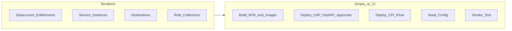

# Client Onboarding & Provisioning

**Status:** Planning draft  
**Parent:** [Architecture_Concept.md](./Architecture_Concept.md)  
**Related:** [Decisions_Log.md](./Decisions_Log.md) (ADR-014), [MVP_Roadmap.md](./MVP_Roadmap.md)

The product must be **repeatably onboardable** onto any client BTP landscape: provision services, configure identity and destinations, deploy runtimes, and smoke-test — via **Terraform** (preferred for cloud resources) plus **thin orchestration scripts** (deploy/bind/seed where Terraform is a poor fit).

**Development home:** one shared **BTP trial** until quality gates pass; then the **same** product is onboarded to the client with new tfvars/secrets only.

---

## 1. Goal

Given a client-specific parameter file, an engineer (or CI) can:

1. **Provision** BTP entitlements / service instances (XSUAA, Destination, PostgreSQL, Redis, optional HANA / AI Core / Integration Suite access).
2. **Configure** IAS/XSUAA role collections, destinations (S/4, OpenRouter/AI Core, CPI), and secrets.
3. **Deploy** Approuter, CAP admin, FastAPI orchestrator, and CPI iFlow artifacts.
4. **Seed** baseline config (e.g. DELIVERY business object, default rate limits, cache TTL).
5. **Verify** health endpoints and a mocked or live insights query.

No hand-clicking through Cockpit except for one-time org/space or IdP federation prerequisites that cannot be automated.

---

## 2. Design principles

| Principle | Meaning |
| --- | --- |
| Client = config, not fork | One product repo; per-client `*.tfvars` / env files only |
| Idempotent | Re-running provision/deploy converges to the same state |
| Split IaC vs CD | Terraform owns long-lived cloud resources; scripts/CI own build + `cf push` / MTA / Kyma apply |
| Environment matrix | `dev` / `qa` / `prod` per client; same modules, different tfvars |
| Runtime switch | `runtime = cloudfoundry \| kyma` selects deploy modules — **both supported** |
| Backend switch | `llm_provider`, `db_engine`, `cache_engine` select adapters — **all combinations first-class** |
| Secrets outside git | API keys and client secrets via CI secret store / BTP Credential Store / env injection |

---

## 3. Target layout (when repo is initialized)

```text
infra/
  terraform/
    modules/
      btp_subaccount/          # optional: subaccount + entitlements
      btp_services/            # XSUAA, Destination, postgres, redis, hana, aicore, ...
      destinations/            # S/4, LLM gateway (OpenRouter / AI Core), CPI
      identity/                # role collections / trust (where API allows)
      cloudfoundry_space/      # org/space wiring
      kyma_runtime/            # Kyma enablement / bindings (first-class)
    environments/
      trial/                   # shared BTP trial tfvars
      _template/
        terraform.tfvars.example
      client-acme-dev/
        terraform.tfvars
    backends/                  # remote state per env
  scripts/
    bootstrap.sh
    provision.sh
    deploy_cf.sh
    deploy_kyma.sh             # first-class, not deferred
    deploy_cpi.sh
    seed_config.sh
    smoke_test.sh
    destroy.sh
  client-config/
    trial/                     # BTP trial client.yaml (build/test home)
    _template/
      client.yaml
    README.md
```

---

## 4. What Terraform provisions vs what scripts deploy



### Terraform (provision)

Typical resources (exact provider resources depend on SAP BTP Terraform provider capabilities available at implementation time):

| Resource | Purpose |
| --- | --- |
| Subaccount / entitlements (optional module) | Isolate client landscape |
| Cloud Foundry space (or Kyma enabled) | Runtime target |
| XSUAA / Authorization & Trust | App security + scopes |
| Destination service + destination configs | S/4, CPI, LLM gateway |
| PostgreSQL (hyperscaler or BTP postgres) | Shared CAP + orchestrator DB — **new service instance per client env** |
| Redis | Cache + rate-limit counters — **new service instance per client env** |
| Optional: HANA Cloud | When `db_engine = hana` |
| Optional: AI Core / GenAI Hub access | When `llm_provider = aicore` |
| Optional: Connectivity / Cloud Connector references | Documented; CC itself often remains ops-owned |
| Remote state + locks | Safe multi-engineer apply |

### Scripts / CI (run & deploy)

| Step | Tooling |
| --- | --- |
| Build CAP MTA | `mbt build` |
| Deploy CAP + Approuter | `cf deploy` / Multi-Target Application |
| Build & push FastAPI image | Docker + `cf push` (docker) or Kyma Deployment |
| Bind services | From Terraform outputs / `VCAP_SERVICES` / binding secrets |
| Deploy CPI iFlow | Integration Suite CI/CD API or transport package |
| Seed data | Idempotent script against CAP OData or SQL |
| Smoke test | `curl` health + authenticated sample query |

**Why not pure Terraform for apps?** CF/MTA and CPI content deploys change often with app versions; keeping them in CI scripts avoids coupling every code release to a full Terraform apply. Terraform still exports service keys, URLs, and destination names that scripts consume.

### PostgreSQL and Redis on BTP (yes — provisioned per environment)

For each **client + environment** (e.g. `acme-dev`, `acme-prod`), onboarding creates **dedicated** data-plane instances (unless a client explicitly mandates sharing — not the default):

| Service | Default MVP | Bound to | Notes |
| --- | --- | --- | --- |
| **PostgreSQL** | New BTP/hyperscaler Postgres **service instance** in the target subaccount/space | CAP + FastAPI (shared schema) | Alternate: HANA Cloud when `db_engine=hana` |
| **Redis** | New Redis **service instance** (BTP Redis / hyperscaler Redis via marketplace) | FastAPI (cache + rate-limit counters) | Alternate: HANA table cache when Redis unavailable |

They are **not** assumed to already exist on the client landscape. Terraform `provision` creates (or adopts via import only if the client provides existing instances in tfvars). Apps receive bindings/`VCAP_SERVICES` (CF) or Kubernetes secrets (Kyma) — no hard-coded hostnames in source.

**Isolation rule:** prefer one Postgres + one Redis **per environment** so QA load and rate-limit counters never collide with prod. Sharing across clients is forbidden.

---

## 5. Client parameter model

### `client.yaml` (product parameters, non-secret)

```yaml
client:
  id: acme
  display_name: ACME Manufacturing
environment: dev
runtime: cloudfoundry          # cloudfoundry | kyma
region: eu10
adapters:
  llm_provider: openrouter     # openrouter | aicore
  db_engine: postgres          # postgres | hana
  cache_engine: redis          # redis | hana_table
s4:
  destination_name: S4HANA_DEST
  auth_mode: technical_user    # technical_user | principal_propagation
features:
  seed_delivery_bo: true
  enable_llm_intent_fallback: false
```

### `terraform.tfvars` (infra)

```hcl
client_id     = "acme"
environment   = "dev"
runtime       = "cloudfoundry"
db_engine     = "postgres"
cache_engine  = "redis"
llm_provider  = "openrouter"
# org/space, subaccount IDs, entitlement plans — client-specific
```

### Secrets (never committed)

- OpenRouter API key / AI Core credentials  
- S/4 technical user password  
- XSUAA client secrets (if not generated by Terraform)  
- DB admin passwords (prefer service-broker generated)

Inject via CI variables or a secrets backend referenced by Terraform.

---

## 6. Standard onboarding runbook

```text
1. Prerequisites (manual / once)
   - BTP global account access
   - Subaccount created OR Terraform allowed to create it
   - Entitlements assigned (CF, Destination, XSUAA, Postgres, Redis, Integration Suite)
   - IAS trust / IdP federation
   - Cloud Connector to S/4 (ops) if on-prem

2. Copy template
   - infra/client-config/_template → client-config/<client>-<env>/
   - infra/terraform/environments/_template → environments/<client>-<env>/

3. Fill client.yaml + tfvars (no secrets in git)

4. Provision
   ./infra/scripts/provision.sh <client> <env>
   → terraform plan/apply
   → write outputs to .deploy/<client>-<env>/outputs.json

5. Deploy
   ./infra/scripts/deploy_cf.sh <client> <env>
   ./infra/scripts/deploy_cpi.sh <client> <env>

6. Seed
   ./infra/scripts/seed_config.sh <client> <env>

7. Smoke
   ./infra/scripts/smoke_test.sh <client> <env>
```

Same flow for the next client: new tfvars + secrets, no product fork.

---

## 7. CF vs Kyma onboarding

| Step | Cloud Foundry | Kyma |
| --- | --- | --- |
| Provision runtime | CF org/space + service instances | Kyma cluster enablement + service instances / operators |
| Deploy CAP | MTA / `cf deploy` | CAP on Kyma / container + service bindings |
| Deploy FastAPI | Docker app on CF | Deployment + Service + APIRule |
| Ingress / SSO | Approuter on CF | Approuter or API gateway + IAS |
| Scripts | `deploy_cf.sh` | `deploy_kyma.sh` |

Terraform modules expose a stable **outputs contract** (`xsuaa`, `postgres`, `redis`, `destination_service`, `app_urls`) so deploy scripts stay thin.

---

## 8. Adapter provisioning matrix

| `adapters.*` value | Terraform provisions | App config |
| --- | --- | --- |
| `llm_provider=openrouter` | Destination or secret for OpenRouter | `LLM_PROVIDER=openrouter` |
| `llm_provider=aicore` | AI Core / GenAI Hub entitlements + binding | `LLM_PROVIDER=aicore` |
| `db_engine=postgres` | Postgres instance | CAP dialect + orchestrator DSN |
| `db_engine=hana` | HANA Cloud instance | CAP HANA + orchestrator HANA DSN |
| `cache_engine=redis` | Redis instance | Redis URL |
| `cache_engine=hana_table` | (uses DB) | Cache adapter = HANA table |

Invalid combinations fail at `terraform plan` / script precheck.

---

## 9. Outputs contract (consumed by deploy scripts)

Illustrative `outputs.json`:

```json
{
  "client_id": "acme",
  "environment": "dev",
  "runtime": "cloudfoundry",
  "xsuaa": { "service_instance": "...", "appname": "factorypilot-acme-dev" },
  "postgres": { "binding_name": "factorypilot-db" },
  "redis": { "binding_name": "factorypilot-redis" },
  "destinations": {
    "s4": "S4HANA_DEST",
    "cpi": "CPI_GENERIC_ODATA",
    "llm": "OPENROUTER"
  },
  "space": { "org": "...", "space": "factorypilot-dev" }
}
```

---

## 10. Trial first, then client (IaC timeline)

| Capability | When |
| --- | --- |
| Docs + templates | Phase 0 |
| Terraform modules for CF **and** Kyma; Postgres/Redis/HANA; OpenRouter **and** AI Core destinations | Phase 1–2 |
| `provision` / `deploy_cf` / `deploy_kyma` / `seed` / `smoke` against **BTP trial** | Phase 2 |
| Matrix checklist (live vs contract-tested) | Phase 2 exit |
| First **client** onboard (copy template, new secrets, apply) | Phase 3 — only after trial gates pass |
| Full subaccount bootstrap automation | As provider support allows |

### Promotion path

```text
infra/client-config/trial  +  terraform/environments/trial
        │  (build, test, flip llm_provider / runtime as entitled)
        ▼  gates green
copy _template → client-<name>-<env>
fill tfvars + secrets
provision → deploy_(cf|kyma) → seed → smoke
```

---

## 11. Acceptance criteria for “client-ready”

A new client is considered onboardable when:

1. **BTP trial** smoke + matrix checklist are already green for the product version being shipped.
2. Engineer copies templates and fills parameters in under one hour (excluding IdP / Cloud Connector wait time).
3. `provision` + `deploy` + `seed` + `smoke` succeed without Cockpit clicks for service creation.
4. No product source changes are required for that client (config and secrets only).
5. Chosen matrix cell (`runtime`, `llm_provider`, `db_engine`, `cache_engine`) is a **supported** combination (implemented adapters), not a stub.
6. Destroy path exists for non-prod to avoid orphaned cost.
