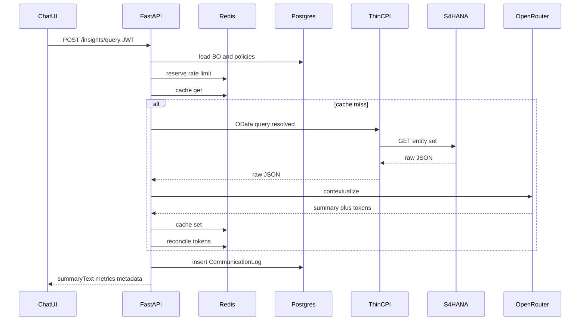

# Component Contracts

**Status:** Planning draft  
**Parent:** [Architecture_Concept.md](./Architecture_Concept.md)

Contracts define the boundaries between Chat UI, FastAPI orchestrator, CAP admin services, CPI, Redis, Postgres, and the LLM provider. Implement against these shapes when Phase 1+ coding starts.

---

## 1. Identity context (all authenticated calls)

Propagated from Approuter / JWT into FastAPI and CAP:

```json
{
  "userId": "user@example.com",
  "sub": "ias-subject-id",
  "scopes": ["InsightsQuery", "InsightsReadOwnUsage"],
  "roles": ["BusinessUser"],
  "tenant": "optional-tenant-id",
  "attributes": {
    "plant": "1000",
    "warehouse": "WH01"
  }
}
```

Scope checks:

- `POST /insights/query` requires `InsightsQuery`
- Admin CAP write services require `ConfigMaintain` / `RateLimitMaintain` / `CacheMaintain`
- Dashboard all-users views require `DashboardAdmin` or `InsightsReadAll`

---

## 2. FastAPI — Insights API

### `POST /insights/query`

**Request**

```json
{
  "questionText": "How many orders are to be delivered today in my warehouse?",
  "businessObjectId": null,
  "filters": {
    "datePreset": "today",
    "warehouse": "WH01"
  },
  "channel": "Web"
}
```

| Field | Required | Notes |
| --- | --- | --- |
| `questionText` | Yes | Natural language question |
| `businessObjectId` | No | If omitted, intent resolution runs |
| `filters` | No | Structured hints; merged with BO default filters |
| `channel` | No | `Web`, `Chatbot`, etc. for audit |

**Success response (200)**

```json
{
  "summaryText": "You have 27 delivery documents scheduled for today in warehouse WH01. Of these, 5 are already shipped and 22 are pending.",
  "metrics": {
    "total": 27,
    "shipped": 5,
    "pending": 22
  },
  "breakdowns": [
    { "key": "status", "items": [{ "name": "Pending", "count": 22 }, { "name": "Shipped", "count": 5 }] }
  ],
  "metadata": {
    "objectCode": "DELIVERY",
    "cacheResult": "MISS",
    "rateLimitResult": "ALLOWED",
    "tokensUsed": 842,
    "totalResponseTimeMs": 1870,
    "logId": "3f2c8a1e-..."
  }
}
```

**Rate limited (429)**

```json
{
  "status": "RATE_LIMITED",
  "message": "Daily token limit exceeded. Try again after the next reset window.",
  "exceededWindow": "DAY",
  "metadata": {
    "rateLimitResult": "DENIED",
    "logId": "..."
  }
}
```

**Error (502 / 500)**

```json
{
  "status": "ERROR",
  "message": "Unable to retrieve S/4HANA data right now.",
  "errorCode": "S4_UPSTREAM",
  "metadata": { "logId": "..." }
}
```

### `GET /insights/health`

Returns `{ "status": "ok" }` for CF/Kyma probes. Unauthenticated or weakly authenticated per landscape policy.

### `GET /insights/usage/me`

Requires `InsightsReadOwnUsage`. Returns day/week/month consumption vs limits for the calling user.

---

## 3. CAP admin data contracts (logical)

Logical fields (CDS names may use managed UUID keys). Exact CDS will be authored in Phase 1.

### BusinessObjectConfig

| Field | Type | Notes |
| --- | --- | --- |
| objectID | UUID | PK |
| objectCode | String(30) | Unique, e.g. `DELIVERY` |
| objectName | String(60) | Display / NLU label |
| moduleDomain | String(30) | Logical module pack, e.g. `SCM`, `FIN`, `PM` — for filtering/analytics, not hard routing |
| keywords | String(500) | Comma-separated synonyms for intent matching |
| destinationName | String(100) | BTP destination |
| odataServicePath | String(200) | e.g. `/sap/opu/odata/sap/API_OUTBOUND_DELIVERY_SRV` |
| entitySet | String(100) | e.g. `A_OutbDeliveryHeader` |
| apiVersion | String(10) | `v2` / `v4` |
| defaultFilters | String(500) | Template with `{warehouse}`, `{today}` placeholders |
| selectFields | String(500) | `$select` list |
| promptHints | String(1000) | Optional LLM contextualization hints per BO |
| isActive | Boolean | |

**Action (admin):** `testConnection` → calls `$metadata` (or CPI ping) and returns success/failure.

**Extensibility rule:** Adding another OData service or business module means inserting/activating a row here (plus optional CacheConfig). It does **not** require a new Integration Suite iFlow for standard OData.

### UserRateLimitConfig

| Field | Type | Notes |
| --- | --- | --- |
| configID | UUID | PK |
| userID | String(100) | User, role, or `DEFAULT` |
| dailyLimit | Integer | |
| weeklyLimit | Integer | |
| monthlyLimit | Integer | |
| limitType | Enum | `REQUEST_COUNT` \| `TOKEN_COUNT` |
| overagePolicy | Enum | `BLOCK` \| `WARN_AND_ALLOW` \| `QUEUE` |
| isActive | Boolean | |

### UserConsumption

| Field | Type | Notes |
| --- | --- | --- |
| consumptionID | UUID | PK |
| userID | String(100) | |
| periodType | Enum | `DAY` \| `WEEK` \| `MONTH` |
| periodStart | Date | |
| consumedCount | Integer | |
| lastUpdated | Timestamp | |

Runtime reserve is Redis-first; Postgres consumption is durable/reconciled for dashboard.

### CacheConfig

| Field | Type | Notes |
| --- | --- | --- |
| cacheConfigID | UUID | PK |
| objectCode | String(30) | FK logical to BO |
| queryPattern | String(200) | Optional, e.g. `today-count` |
| cacheEnabled | Boolean | |
| ttlValue | Integer | |
| ttlUnit | Enum | `MINUTES` \| `HOURS` \| `DAYS` |
| cacheKeyStrategy | Enum | `PER_USER` \| `PER_ROLE` \| `GLOBAL` |
| isActive | Boolean | |

### CommunicationLog

| Field | Type | Notes |
| --- | --- | --- |
| logID | UUID | PK |
| timestamp | Timestamp | |
| userID | String(100) | |
| channel | String(40) | |
| objectCode | String(30) | |
| userQuery | String(1000) | |
| odataURLCalled | String(500) | |
| odataResponseTimeMs | Integer | |
| cacheResult | Enum | `HIT` \| `MISS` \| `NOT_APPLICABLE` |
| rateLimitResult | Enum | `ALLOWED` \| `DENIED` |
| llmProvider | String(100) | |
| llmModel | String(100) | |
| tokensUsed | Integer | |
| totalResponseTimeMs | Integer | |
| status | Enum | `SUCCESS` \| `RATE_LIMITED` \| `ERROR` |
| responseSummary | String(2000) | Truncated answer for audit UI |
| errorDetail | String(1000) | |

---

## 4. CPI thin iFlow contract

### `POST /http/s4/odata/query` (illustrative path)

Called only by the orchestrator (client credentials or forward user token per landscape).

**Request**

```json
{
  "destinationName": "S4HANA_DEST",
  "servicePath": "/sap/opu/odata/sap/API_OUTBOUND_DELIVERY_SRV",
  "entitySet": "A_OutbDeliveryHeader",
  "apiVersion": "v2",
  "queryOptions": {
    "filter": "OverallGoodsMovementStatus eq 'A' and ShippingPoint eq 'WH01'",
    "select": "DeliveryDocument,OverallGoodsMovementStatus,ShippingPoint",
    "top": 200
  },
  "correlationId": "log-or-trace-id"
}
```

**Response (200)**

```json
{
  "statusCode": 200,
  "body": { "d": { "results": [] } },
  "elapsedMs": 320
}
```

**Error**

```json
{
  "statusCode": 502,
  "errorCode": "S4_ODATA_FAILED",
  "message": "Upstream OData call failed",
  "elapsedMs": 5000
}
```

iFlow responsibilities: destination lookup, CSRF if needed, OData GET, retry/timeout, map errors. No LLM, no cache, no **product** rate limit, **no OData service catalog** (catalog lives in CAP). The same iFlow must work for any `servicePath` / `entitySet` the orchestrator sends — SCM today, other modules tomorrow.

Optional **API Management** rate policies may sit in front of the product API later as abuse protection only; they do not replace FastAPI/Redis day–week–month / token limits (ADR-009).

---

## 5. LLM adapter contract

LangGraph (and any other caller) uses this interface only — see Architecture Concept §15 and ADR-019.

```text
complete(request: LLMRequest) -> LLMResponse
```

**LLMRequest**

```json
{
  "messages": [
    { "role": "system", "content": "You summarize S/4 delivery data for warehouse supervisors..." },
    { "role": "user", "content": "Question: ...\nData: {...}" }
  ],
  "model": "optional-override",
  "maxTokens": 800,
  "temperature": 0.2,
  "metadata": { "objectCode": "DELIVERY", "userId": "..." }
}
```

**LLMResponse**

```json
{
  "text": "You have 27 delivery documents...",
  "structured": {
    "summaryText": "You have 27 delivery documents...",
    "metrics": { "total": 27, "shipped": 5, "pending": 22 },
    "breakdowns": []
  },
  "provider": "openrouter",
  "model": "model-id",
  "tokensUsed": 842,
  "promptTokens": 700,
  "completionTokens": 142
}
```

Bindings:

- `OpenRouterLLMProvider` (MVP)
- `AICoreLLMProvider` (stub / later)

---

## 6. Cache adapter contract

```text
get(key) -> cached_payload | null
set(key, payload, ttlSeconds) -> void
delete(key) -> void
```

Cache key material (hashed):

```text
objectCode | normalizedFilters | strategySubject | queryPattern
```

`strategySubject` is `userId`, `roleId`, or `GLOBAL` per `cacheKeyStrategy`.

For `datePreset=today`, TTL = `min(configuredTTL, secondsUntilMidnight)`.

---

## 7. Rate-limit service contract

```text
checkAndReserve(userId, scopes, estimatedCost) -> Allow | Deny
reconcile(userId, actualTokens) -> void
```

**Allow**

```json
{ "decision": "ALLOWED", "remaining": { "day": 40, "week": 200, "month": 900 } }
```

**Deny**

```json
{ "decision": "DENIED", "exceededWindow": "DAY", "retryAfterEpoch": 1735689600 }
```

Administrators with elevated scopes may use a higher configured quota or an explicit bypass policy documented in admin config (never hard-coded silent bypass without audit).

---

## 8. Sequence (happy path)



---

## 9. Versioning

- Public HTTP APIs version via path prefix when breaking changes appear (`/insights/v1/...`).
- MVP may ship unversioned `/insights/*` and freeze the shapes in this document.
- CPI contract and LLM adapter are internal; bump `correlationId` / adapter interface version in code when changed.
