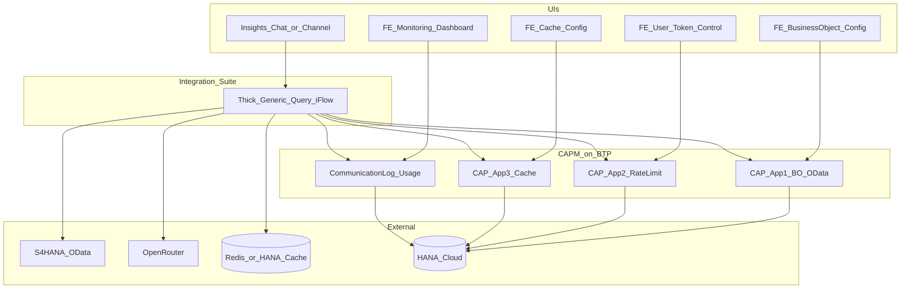
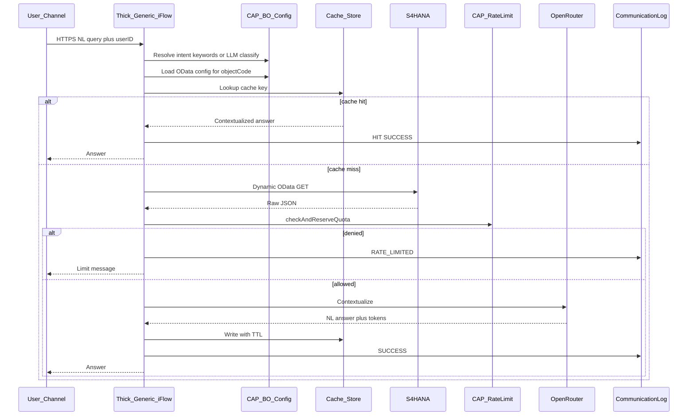
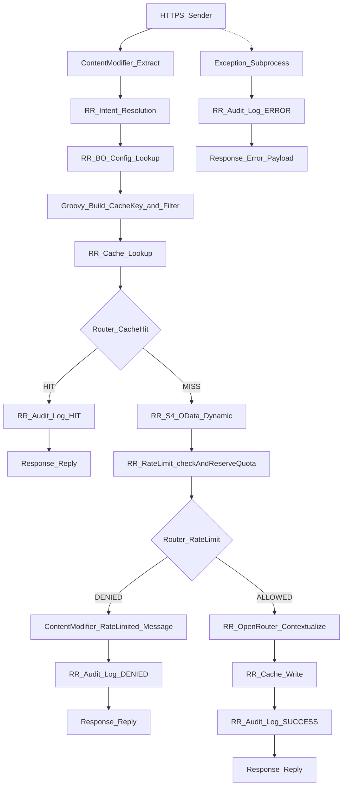

# Requirements-Aligned Architecture: Thick CPI + Three CAPM Apps

**Status:** Reference baseline from source requirements (not the hybrid FastAPI target)  
**Version:** 1.0  
**Sources:**

- [Documentation.docx.md](../requirements/Documentation.docx.md)
- [Technical_Design_Document.docx.md](../requirements/Technical_Design_Document.docx.md)

**Related (chosen hybrid approach):** [Architecture_Concept.md](./Architecture_Concept.md)

This document restates how the platform looks **if built as specified in the shared requirements / TDD**: a **thick, metadata-driven CPI iFlow** as the runtime orchestrator, **three CAPM (CAP) configuration apps** with Fiori UIs, plus logging/dashboard capabilities. It includes a **detailed iFlow design** suitable for Integration Suite implementation planning.

---

## 1. Design thesis (requirements view)

| Concern | Owner in requirements / TDD |
| --- | --- |
| Business object & OData registration | CAPM App 1 |
| User token / rate-limit control | CAPM App 2 |
| Cache TTL / key strategy | CAPM App 3 |
| End-to-end query orchestration | **Thick generic CPI iFlow** |
| S/4HANA OData access | Same iFlow (dynamic OData) |
| LLM contextualization | Same iFlow → OpenRouter |
| Audit / communication log | CAP entity written from iFlow |
| Monitoring dashboard | CAP + Fiori (SAC optional) |

**Core idea:** Functional consultants configure BO/OData, rate limits, and cache in CAP. A **single generic iFlow** reads that metadata and runs intent → config → cache → S/4 → rate limit → LLM → cache write → audit — **without one iFlow per business object**.

> Note: The business Documentation also describes a CAP-orchestrated variant (rate limit in CAP, CPI thinner, contextualization in CAP). The **TDD thick-CPI flow** is what this document elaborates in detail. Where the two conflict, TDD steps are used for the iFlow design below, with Documentation notes called out.

---

## 2. Component landscape



| # | Component | Type | Responsibility |
| --- | --- | --- | --- |
| 1 | Business Object Configuration App | CAPM + Fiori Elements | BO catalog, OData URL, entity set, filters, keywords |
| 2 | User Token Control App | CAPM + Fiori Elements | Day/week/month limits; `checkAndReserveQuota` |
| 3 | Cache Configuration App | CAPM + Fiori Elements | TTL, key strategy, enable/disable |
| 4 | Generic Query iFlow | CPI (thick) | Full orchestration including S/4 + LLM |
| 5 | LLM gateway | OpenRouter | Contextualize OData JSON → NL answer |
| 6 | Cache store | Redis / HANA table | Contextualized response cache |
| 7 | Usage & audit | CAP entities | `UserConsumption`, `CommunicationLog` |
| 8 | Monitoring dashboard | CAP + Fiori (± SAC) | Tokens, throughput, cache hits, logs |

---

## 3. Front-ends / UIs (requirements view)

Requirements imply **multiple Fiori Elements UIs** (typically one List Report + Object Page per CAP app), plus a **calling channel** for questions (chatbot / Fiori / Joule-style UI).

| UI | Audience | Backed by | Main actions |
| --- | --- | --- | --- |
| **Business Object Config** | Admin / functional consultant | CAPM App 1 | CRUD BOs, keywords, OData path, filters; **Test Connection** |
| **User Token / Rate Limit** | Admin | CAPM App 2 | CRUD limits per user/role; view consumption; block/override |
| **Cache Configuration** | Admin | CAPM App 3 | TTL, unit, key strategy, enable per BO/pattern |
| **Monitoring Dashboard** | Admin / viewer | CAP analytical views + log | KPIs + Communication Log explorer |
| **Insights channel** | Business user | Calls CPI HTTPS endpoint | Submit NL question; display summary |

Packaging options consistent with requirements:

- Three (or four) Fiori Elements apps on a shared Approuter / launchpad, or  
- One CAP MTA exposing multiple UI modules  

Admin vs Viewer scopes restrict configuration apps; business users only need the Insights channel.

---

## 4. CAPM App 1 — Business Object & OData configuration

### Purpose

Register each business object (Sales, Delivery, Shipping, Goods Movement, Purchasing, …) and its S/4 OData metadata so the iFlow stays generic.

### Entity: `BusinessObjectConfig`

| Field | Type | Description |
| --- | --- | --- |
| objectID | UUID | PK |
| objectCode | String(30) | e.g. `SALES`, `DELIVERY`, `SHIPPING`, `GOODS_MOVEMENT`, `PURCHASING` |
| objectName | String(60) | Display / NLU label |
| keywords | String(500) | Comma-separated synonyms for intent match |
| destinationName | String(100) | BTP Destination to S/4 |
| odataServicePath | String(200) | e.g. `/sap/opu/odata/sap/API_DELIVERY_DOCUMENT_SRV` |
| entitySet | String(100) | e.g. `DeliveryDocument` |
| defaultFilters | String(500) | `$filter` template (`today`, `{userPlant}`, …) |
| selectFields | String(500) | `$select` projection |
| apiVersion | String(10) | `v2` / `v4` |
| isActive | Boolean | Soft enable |
| managed | created/modified | Audit fields |

### UI / behavior

- Fiori Elements List Report + Object Page (draft-enabled recommended)
- Validation: unique `objectCode`; path + entitySet mandatory when `isActive`
- Action **Test Connection**: `$metadata` (and optional sample query) via destination
- Adding a BO = configuration only — **no new iFlow**

---

## 5. CAPM App 2 — User token / rate-limit control

### Entities

**`UserRateLimitConfig`**

| Field | Type | Description |
| --- | --- | --- |
| configID | UUID | PK |
| userID / roleID | String(100) | User, role, or `DEFAULT` |
| dailyLimit / weeklyLimit / monthlyLimit | Integer | Caps |
| limitType | Enum | `REQUEST_COUNT` \| `TOKEN_COUNT` |
| overagePolicy | Enum | `BLOCK` \| `WARN_AND_ALLOW` \| `QUEUE` |
| isActive | Boolean | |

**`UserConsumption`**

| Field | Type | Description |
| --- | --- | --- |
| consumptionID | UUID | PK |
| userID | String(100) | |
| periodType | Enum | `DAY` \| `WEEK` \| `MONTH` |
| periodStart | Date | Window start |
| consumedCount | Integer | |
| lastUpdated | Timestamp | |

### Runtime contract used by iFlow

```http
POST /checkAndReserveQuota
{
  "userID": "...",
  "requestedTokens": 800
}
```

Response: `ALLOWED` + remaining windows, or `DENIED` + exceeded window.

TDD placement: rate check **after S/4 OData, before LLM** (LLM is primary cost driver). Documentation alternatively checks rate limit **before** calling CPI — see §10.

---

## 6. CAPM App 3 — Cache configuration

### Entity: `CacheConfig`

| Field | Type | Description |
| --- | --- | --- |
| cacheConfigID | UUID | PK |
| objectCode | String(30) | Links to BO |
| queryPattern | String(200) | Optional finer grain (e.g. `today-count`) |
| cacheEnabled | Boolean | |
| ttlValue | Integer | |
| ttlUnit | Enum | `MINUTES` \| `HOURS` \| `DAYS` |
| cacheKeyStrategy | Enum | `PER_USER` \| `PER_ROLE` \| `GLOBAL` |
| isActive | Boolean | |

### Behavior

- Cache key = hash(`objectCode` + normalized filters + subject from strategy)
- Default TTL fallback (e.g. 15 minutes) if no active row
- Store: Redis preferred; HANA table + cleanup job as alternative
- Cache stores the **already contextualized** answer (skip S/4 + LLM on hit)

---

## 7. Logging & monitoring

### `CommunicationLog` (written by iFlow on every path)

| Field | Type |
| --- | --- |
| logID, timestamp, userID, objectCode, userQuery | |
| odataURLCalled, odataResponseTimeMs | |
| cacheResult: HIT \| MISS \| NOT_APPLICABLE | |
| rateLimitResult: ALLOWED \| DENIED | |
| llmProvider / model, tokensUsed | |
| totalResponseTimeMs | |
| status: SUCCESS \| RATE_LIMITED \| ERROR | |
| errorDetail | |

### Dashboard views (CAPM / Fiori ± SAC)

- Tokens used vs limits (day/week/month)
- Throughput by business object
- Cache hit ratio
- Rate-limit rejections
- Latency breakdown (OData vs LLM vs cache hit)
- Communication log explorer
- Top questions / objects

---

## 8. End-to-end flow (TDD thick CPI)



---

## 9. Detailed iFlow design — `Generic_S4_Business_Insights_Query`

### 9.1 Package & naming

| Item | Proposal |
| --- | --- |
| Integration package | `FactoryPilot_BusinessInsights` |
| iFlow name | `Generic_S4_Business_Insights_Query` |
| Sender | HTTPS (or OData sender if wrapped by API Management) |
| Address (example) | `/http/factorypilot/insights/query` |
| Auth | OAuth2 / client credentials or principal propagation from channel; map `userID` from JWT / header |

### 9.2 Inbound contract

**Request body (JSON):**

```json
{
  "userID": "user@example.com",
  "userQuery": "How many orders are to be delivered today in my warehouse?",
  "businessObjectId": null,
  "filters": {
    "datePreset": "today",
    "warehouse": "WH01",
    "plant": "1000"
  },
  "channel": "Web",
  "tenant": "optional"
}
```

**Headers (recommended):**

| Header | Use |
| --- | --- |
| `Authorization` | Bearer JWT |
| `X-Correlation-ID` | End-to-end trace (generate if missing) |
| `Content-Type` | `application/json` |

### 9.3 Exchange properties (Content Modifier early)

| Property | Source | Used by |
| --- | --- | --- |
| `P_CorrelationId` | Header or UUID | All logs |
| `P_UserId` | Body / JWT | Rate limit, cache key, log |
| `P_UserQuery` | Body | Intent, LLM, log |
| `P_Tenant` | Body / JWT | Multi-tenant keying |
| `P_FiltersJson` | Body | OData filter merge |
| `P_Channel` | Body | Log |
| `P_StartEpochMs` | Script | `totalResponseTimeMs` |
| `P_ObjectCode` | Intent step | Config, cache, log |
| `P_DestinationName` | Config lookup | S/4 call |
| `P_ServicePath` | Config | S/4 call |
| `P_EntitySet` | Config | S/4 call |
| `P_SelectFields` | Config | S/4 call |
| `P_FilterExpression` | Script merge | S/4 call |
| `P_ApiVersion` | Config | Query syntax |
| `P_CacheKey` | Script hash | Cache get/set |
| `P_CacheTtlSeconds` | Cache config | Cache set |
| `P_CacheResult` | HIT/MISS/… | Log |
| `P_RateLimitResult` | ALLOWED/DENIED | Router / log |
| `P_ODataUrlCalled` | Built URL | Log |
| `P_ODataResponseTimeMs` | Timer | Log |
| `P_TokensUsed` | LLM response | Log / reconcile |
| `P_LlmModel` | LLM response | Log |
| `P_Status` | SUCCESS/… | Response / log |
| `P_AnswerJson` | Cache or LLM | Response |
| `P_ErrorDetail` | Exception | Log |

### 9.4 Process steps (implementation map)



#### Step 1 — HTTPS Sender

- Method: `POST`
- CSRF: as required by tenant policy
- Body size limit: protect against oversized prompts
- Optional: front with **API Management** for coarse spike arrest (product day/week/month limits still via CAP App 2)

#### Step 2 — Content Modifier

- Parse JSON → properties listed in §9.3
- Set `P_StartEpochMs`
- Validate required: `userQuery`, `userID` (or derive from token)

#### Step 3 — Intent resolution (Request-Reply)

**Option A (recommended default in TDD open points):**  
Call CAP App 1: list active `BusinessObjectConfig` (or dedicated action `resolveIntent`) and match `keywords` against `P_UserQuery` (case-insensitive, longest/most-specific wins).

**Option B:** HTTP call to OpenRouter with a short classification prompt returning `objectCode` only (higher cost/latency).

If `businessObjectId` already provided in request, skip matching and set `P_ObjectCode` directly.

**On failure:** set `P_Status=ERROR`, `P_ErrorDetail=INTENT_UNRESOLVED` → exception path.

#### Step 4 — Config lookup (Request-Reply)

- OData GET CAP App 1:  
  `BusinessObjectConfig?$filter=objectCode eq '{P_ObjectCode}' and isActive eq true`
- Map destination, service path, entity set, defaultFilters, selectFields, apiVersion → properties
- Optionally parallel GET CacheConfig for same `objectCode` (+ queryPattern)

#### Step 5 — Groovy / Script: build filter + cache key

Responsibilities:

1. Merge `defaultFilters` template with `P_FiltersJson` and user attributes (`warehouse`, `plant`, `today` → OData date literal).
2. Build OData query string (`$filter`, `$select`, `$top`).
3. Normalize filter string for hashing.
4. Resolve cache subject: user / role / `GLOBAL` from `cacheKeyStrategy`.
5. `P_CacheKey = sha256(objectCode + '|' + normalizedFilter + '|' + subject + '|' + queryPattern)`.
6. Compute `P_CacheTtlSeconds` from ttlValue/ttlUnit; optionally cap to midnight for `datePreset=today`.

#### Step 6 — Cache lookup (Request-Reply)

- Redis GET `P_CacheKey` **or** CAP/HANA cache entity GET
- Router condition: body/property non-empty → **HIT**

**HIT path:**

- Set `P_CacheResult=HIT`, `P_Status=SUCCESS`, `P_AnswerJson=cached`
- Skip S/4, rate limit, LLM
- Write audit log → Respond

**MISS path:** continue

#### Step 7 — S/4 OData call (Request-Reply) — cache miss only

- Receiver: HTTP/OData adapter using **dynamic** destination = `P_DestinationName`
- URL: `{servicePath}/{entitySet}?$filter=...&$select=...&$top=...`
- Handle CSRF for S/4 if required (separate head request or adapter setting)
- Timer → `P_ODataResponseTimeMs`
- Store raw payload in property `P_ODataRaw` (and optionally trim/page)
- On failure: exception subprocess (`S4_UPSTREAM`)

Dynamic address pattern (conceptual):

```text
${property.P_ServicePath}/${property.P_EntitySet}?$filter=${property.P_FilterExpression}&$select=${property.P_SelectFields}&$top=200
```

#### Step 8 — Rate limit check (Request-Reply)

- Call CAP App 2 action `checkAndReserveQuota(userID, requestedTokens)`
- `requestedTokens`: estimate from payload size + fixed completion budget, or configured `PerRequestMaxTokens`
- Router:
  - `ALLOWED` → LLM
  - `DENIED` → build rate-limit message; `P_Status=RATE_LIMITED`; audit; respond **without** LLM  
    (TDD: optionally still return raw data — product choice)

#### Step 9 — LLM contextualization (Request-Reply)

- Destination / credential: OpenRouter API key in **Secure Parameter / Destination**, never hard-coded in iFlow
- HTTP POST chat completions
- Prompt includes: system instructions per BO (optional from config), `P_UserQuery`, trimmed `P_ODataRaw`
- Parse response → `P_AnswerJson` (summaryText, metrics, breakdowns), `P_TokensUsed`, `P_LlmModel`
- Optional: call CAP to reconcile actual tokens if estimate differed
- Timeouts + retry with backoff; **do not** double-reserve quota on retry (idempotent correlation id)

#### Step 10 — Cache write (Request-Reply)

- Only on successful LLM path
- SET key `P_CacheKey` with TTL `P_CacheTtlSeconds`
- Value = contextualized JSON answer

#### Step 11 — Audit log write (Request-Reply) — **all paths**

- POST `CommunicationLog` to CAP (or dedicated logging service)
- Exactly **one** log row per request (HIT, SUCCESS, RATE_LIMITED, ERROR)
- Include correlation id, timings, tokens, status

#### Step 12 — HTTPS response

**Success:**

```json
{
  "summaryText": "You have 27 delivery documents scheduled for today in warehouse WH01.",
  "metrics": { "total": 27, "pending": 22, "shipped": 5 },
  "breakdowns": [],
  "metadata": {
    "objectCode": "DELIVERY",
    "cacheResult": "MISS",
    "rateLimitResult": "ALLOWED",
    "tokensUsed": 842,
    "totalResponseTimeMs": 2100,
    "correlationId": "..."
  }
}
```

**Rate limited:** HTTP 429 or 200 with `status: RATE_LIMITED` (align with API guidelines).  
**Error:** graceful message + `correlationId`; no stack traces to client.

### 9.5 Exception subprocess

| Catch | `P_ErrorDetail` code | User message |
| --- | --- | --- |
| Intent / config | `CONFIG_OR_INTENT` | Unable to understand or configure this question |
| S/4 / destination | `S4_UPSTREAM` | Unable to retrieve S/4HANA data |
| Rate limit service | `RATE_LIMIT_SERVICE` | Temporarily unable to check quota |
| OpenRouter timeout/5xx | `LLM_UPSTREAM` | Unable to generate insight right now |
| Cache store | `CACHE_STORE` | Continue without cache if policy allows; else error |
| Generic | `UNEXPECTED` | Unexpected error |

Always: write ERROR `CommunicationLog` → return fallback JSON.

### 9.6 Adapter timeouts & retries (suggested)

| Call | Timeout | Retry |
| --- | --- | --- |
| CAP config / rate limit | 3–5 s | 1–2× idempotent GETs |
| Cache | 1–2 s | 0–1× |
| S/4 OData | 10–15 s | 1× on 503/timeout |
| OpenRouter | 20–30 s | 1× on 429/503 with backoff; honor Retry-After |

Circuit-breaker style: after N consecutive S/4 or LLM failures, fail fast with clear status (optional ProcessDirect to health iFlow).

### 9.7 Security

- OpenRouter key: BTP Destination / Credential Store only
- CAP calls: OAuth2 client credentials or user token propagation with scopes
- S/4: Destination with technical user (MVP) or principal propagation
- Role-restrict CAP config apps (`Administrator` vs `Viewer`)
- Do not log full OData PII payloads in CommunicationLog — store URL + summary/truncated

### 9.8 Extensibility (requirements NFR)

Adding **Purchasing** or a future module OData service:

1. Create/activate row in Business Object Config UI  
2. Optional CacheConfig + rate-limit defaults  
3. **No iFlow change** for standard OData v2/v4  

Only non-OData protocols would need additional receiver patterns.

---

## 10. Documentation vs TDD differences (keep visible)

| Topic | Documentation.docx | Technical Design Document | This baseline uses |
| --- | --- | --- | --- |
| Orchestrator | CAP calls CPI; CAP contextualizes | **Thick CPI** does all steps | **Thick CPI (TDD)** |
| Rate limit timing | Before CPI / S/4 | After S/4, before LLM | **TDD** (note Doc alternate) |
| Contextualization | CAP service + business rules | OpenRouter from iFlow | **OpenRouter in iFlow** |
| CAP apps | 3 config + contextualization/logging services | 3 config apps + log entity | **3 FE config apps + shared log/dashboard** |

Teams adopting the **hybrid FastAPI** approach should treat this file as the **requirements baseline**, and [Architecture_Concept.md](./Architecture_Concept.md) as the **target implementation architecture**.

---

## 11. Technology stack (as in TDD §9)

| Layer | Technology |
| --- | --- |
| 3× configuration apps | SAP CAP + Fiori Elements (CF / Kyma) |
| Database | SAP HANA Cloud (TDD); Postgres also viable in hybrid |
| Integration | SAP Integration Suite — **thick** generic iFlow |
| S/4 | Cloud Connector + Destination + OData v2/v4 |
| LLM | OpenRouter |
| Cache | Redis (preferred) or HANA table |
| Dashboard | CAP analytics + Fiori; SAC optional |
| Auth | XSUAA / IAS |

---

## 12. Open points carried from TDD §10.2

1. Intent: keyword-only vs LLM classify  
2. Rate limit before S/4 as well as before LLM?  
3. Midnight invalidation for “today” queries  
4. OpenRouter model policy / per-BO model  
5. Fiori vs SAC for dashboard  
6. Finalize formal BPMN/sequence appendices after the above are confirmed  

---

## 13. How to use this document

- **Stakeholders / BA:** Validate that thick CPI + three CAPM apps + UIs match the signed requirements.  
- **CPI developers:** Implement §9 step-by-step (`Generic_S4_Business_Insights_Query`).  
- **CAP developers:** Build Apps 1–3 + CommunicationLog + dashboard views.  
- **Architecture board:** Compare with [Architecture_Concept.md](./Architecture_Concept.md) (FastAPI + thin CPI) when choosing the build path.
